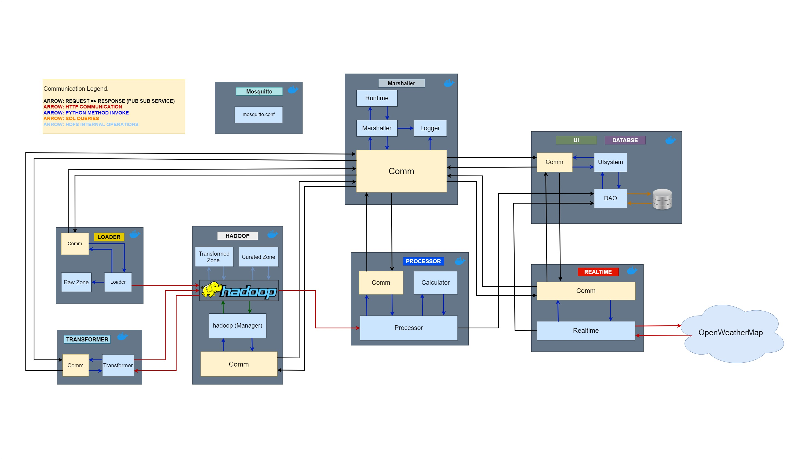

# Brazil Weather Analysis

**Historical and realtime analysis of climate for surface of Brazil** 

## Table of Contents
- [About the Dataset](#about-the-dataset)
- [About the Project](#about-the-project)
  - [Introduction](#introduction)
  - [Batch Processing Questions](#batch-processing-questions)
  - [Realtime Processing Questions](#realtime-processing-questions)
- [Repository Structure](#repository-structure)
- [Getting Started](#getting-started)
- [Architecture](#architecture)
- [Components](#components)
  - [Marshaller](#marshaller)
  - [Processor](#processor)
  - [Loader](#loader)
  - [Transformer](#transformer)
  - [Hadoop](#hadoop)
  - [Realtime](#realtime)
  - [UI](#ui)
  - [Mosquitto](#mosquitto)
- [Scripts](#scripts)
  - [Building docker images](#building-docker-images)
  - [Clearing](#clearing)
  - [Complete setup](#complete-setup)
  - [Configure SSH](#configure-ssh)
  - [Start SYSTEM](#start-system)

## About the Dataset

### Context

This dataset covers hourly weather data from 623 INMET weather stations in Brazil.

**Dataset Source:** INMET (National Meteorological Institute - Brazil).

**Equipment:** Vaisala Automatic Weather Station AWS310

**Category:** Weather

**Size:** 10.11GB

The dataset can be downloaded from [Kaggle](https://www.kaggle.com/datasets/PROPPG-PPG/hourly-weather-surface-brazil-southeast-region).

### Content

The dataset includes the following data:

| Data                                         | Description                                                 |
|----------------------------------------------|-------------------------------------------------------------|
| Date (YYYY-MM-DD)                            | The date of the observation                                 |
| Time (HH:00)                                 | The time of the observation                                 |
| Amount of precipitation (mm)                 | Amount of precipitation in millimeters (last hour)          |
| Atmospheric pressure at station level (mb)   | Atmospheric pressure at station level                       |
| Maximum air pressure (mb)                    | Maximum air pressure for the last hour                      |
| Minimum air pressure (mb)                    | Minimum air pressure for the last hour                      |
| Solar radiation (KJ/m2)                      | Solar radiation                                             |
| Air temperature (instant) (°C)               | Instantaneous air temperature                               |
| Dew point temperature (instant) (°C)         | Instantaneous dew point temperature                         |
| Maximum temperature (°C)                     | Maximum temperature for the last hour                       |
| Minimum temperature (°C)                     | Minimum temperature for the last hour                       |
| Maximum dew point temperature (°C)           | Maximum dew point temperature for the last hour             |
| Minimum dew point temperature (°C)           | Minimum dew point temperature for the last hour             |
| Maximum relative humidity (%)                | Maximum relative humidity for the last hour                 |
| Minimum relative humidity (%)                | Minimum relative humidity for the last hour                 |
| Relative humidity (instant) (%)              | Instantaneous relative humidity                             |
| Wind direction (degrees)                     | Wind direction in radius degrees (0-360)                    |
| Wind gust (m/s)                              | Wind gust in meters per second                              |
| Wind speed (m/s)                             | Wind speed in meters per second                             |
| Brazilian geopolitical regions               | Geopolitical region of Brazil                               |
| State (Province)                             | State or province                                           |
| Station Name                                 | Name of the weather station (usually city location or nickname) |
| Station code (INMET number)                  | Code number of the INMET station                            |
| Latitude                                     | Geographic latitude of the station                          |
| Longitude                                    | Geographic longitude of the station                         |
| Elevation                                    | Elevation of the station in meters                          |


## About the Project

### Introduction
This project focuses on designing and implementing an architecture for processing large datasets,
demonstrated through data transformation, analysis, and presentation.
It utilizes two datasets from distinct sources, with the primary dataset containing historical data with size of 10.11GB,
and secondary dataset of getting realtime information from **OpenWeatherApi** once per second per city/region.
A data lake with raw, transformation, and curated zones is created, and the loading of the dataset into the data lake is automated.
The system's architecture is divided into 8 Docker containers for modular communication, and shell scripts are provided
for easy system usage. Data processing includes batch processing with 10 complex queries/transformations and
real-time processing with 5 complex data transformations. Results are visualized for the end-user,
and mechanisms for automated data processing are in place. The entire system is designed to be fully automated,
ensuring seamless operation and efficiency in handling large-scale data processing tasks.

### Batch Processing Questions

1. What is the average temperature for each province in the specified region over the last few months?
2. How much total rainfall has each province in the specified region received in each month of the period?
3. What are the highest and lowest atmospheric pressures recorded in each province of the specified region over the selected period?
4. What is the average wind speed for each province in the specified region over the last few months?
5. How much total solar radiation has each province in the specified region received in each month of the period?
6. What is the distribution of wind directions (North, East, South, West) for each province in the specified region over the selected period?
7. How variable is the humidity in each province of the specified region over the last few months?
8. What is the average Temperature-Humidity Index (THI) for each province in the specified region over the selected period?
9. What is the range of dew point temperatures for each province in the specified region over the last few months?
10. How variable is the air temperature in each province of the specified region over the selected period?

### Realtime Processing Questions

1. How does the average real-time temperature compare to the historical average temperature across provinces in a specific region over a given period?
2. How do the pressure variations above the minimum and below the maximum compare across provinces in a specific region over a given period, in comparison to historical pressure data?
3. How does the real-time Temperature-Humidity Index (THI) compare to the average THI across provinces in a specific region over a given period?
4. How does the real-time wind speed compare to the average wind speed across provinces in a specific region over a given period?
5. What would be the probability of average wind direction calculated from real-time data occurring during in same region and province over a given period?

## Repository Structure

```

BrazilWeather/  
├── v10_Scripts/  
│ ├── buildDockerImages.sh  
│ ├── clear.sh  
│ ├── completeSetup.sh  
│ ├── configureSSH.sh  
│ ├── downloadDataSet.py  
│ ├── downloadDataSet.sh  
│ └── startSystem.sh  
├── v20_Test/  
│ ├── checkDataBase.py  
│ ├── checkDataBase.sh  
│ ├── processData.py  
│ └── processData.sh  
├── v30_Dataset/  
│ └── .gitkeep  
├── v40_Libraries/  
│ └── .gitkeep  
├── v50_Components/  
│ ├── Hadoop_comp/  
│ │ ├── comm.py  
│ │ ├── configureHadoop.sh  
│ │ ├── Dockerfile  
│ │ ├── hadoop.py  
│ │ ├── startHadoopServices.sh  
│ │ └── stopHadoopServices.sh  
│ ├── Loader_comp/  
│ │ ├── comm.py  
│ │ ├── Dockerfile  
│ │ └── loader.py  
│ ├── Marshaller_comp/  
│ │ ├── comm.py  
│ │ ├── configuration.json  
│ │ ├── Dockerfile  
│ │ ├── logger.py  
│ │ ├── marshaller.py  
│ │ └── runtime.py  
│ ├── Mosquitto_comp/  
│ │ ├── Dockerfile  
│ │ └── mosquitto.conf  
│ ├── Processor_comp/  
│ │ ├── calculator.py  
│ │ ├── comm.py  
│ │ ├── Dockerfile  
│ │ └── processor.py  
│ ├── Realtime_comp/  
│ │ ├── city_province.json  
│ │ ├── comm.py  
│ │ ├── configuration.json  
│ │ ├── Dockerfile  
│ │ └── realtime.py  
│ ├── Transformer_comp/  
│ │ ├── comm.py  
│ │ ├── Dockerfile  
│ │ └── transformer.py  
│ └── UI_comp/  
│ ├── comm.py  
│ ├── daoHandler.py  
│ ├── Dockerfile  
│ └── uiSystem.py  
├── .gitignore  
├── commands.txt  
├── README.md  
└── specification.pdf  
```

## Getting Started

To set up the project and build the Docker containers, follow these steps:

1. Run the `completeSetup.sh` script to prepare the environment for the Docker containers.
2. Download the dataset manually from the link provided in [About the Dataset](#about-the-dataset)
since the `downloadDataSet.sh` script requires a `credentials.json` file,
which is not available in the repository (these are credentials to download dataset hosted in private Google Drive).
After downloading, extract the dataset into the `v30_Dataset` directory.
3. In v50_Components/Realtime_comp create a json file names ```apikey.json``` which has to be structured:  
  ```
  {  
    "key" : "your_openweather_api_key"  
  }  
  ```
4. Run the `buildDockerImages.sh` script to build all 8 Docker images for the system.
5. To start the Docker containers, run the `startSystem.sh` script.

The responsibilities of each script will be discussed in detail in the Scripts section.

## Architecture
The system architecture is designed to be modular and scalable, with components split into 8 Docker containers.  
The Marshaller component plays a crucial role in orchestrating other containers.
None of the containers except Marshaller once started won't do anything on their own, they are listening for requests
on certain topic required for them, processing the request and sending the response back to Marshaller.
They have internal logic of how different requests are processed and what the response shall be.  

Marshaller communicates in parallel by creating a separate thread for each container, ensuring efficient handling
of requests and responses, it also has its own runtime, where thread safe objects are stored required for managing
what requests will be sent to which components. Reason behind that is that components are dependent, in terms of
their previous work can enable/disable processing certain requests of other componentes.  

Communication within each thread is synchronous, following a request-response model. This approach allows for precise
control over the flow of data and ensures that each component receives the necessary information in a timely manner.  

Specifically, communication between the Hadoop component and the Loader, as well as between Hadoop and the Transformer,
is achieved through HTTP. This choice of communication protocol enables seamless data transfer between these components,
facilitating efficient data processing and transformation.

Similarly, the communication between the Processor and Hadoop also utilizes HTTP, ensuring consistency and reliability
in data exchange.

Once the system is started Marshaller as a first request will try to ping all containers before sending them tasks,
once component replies that it is alive it will start to handle requests from Marshaller.  

Each request has its preconfigured timeout, when broken Marshaller will proclaim component to be dead and try to ping
again until getting the required response.  

With runtime keeping track of what is processed and what isn't same requests for data processing won't be sent to
components, even if their stop responding to requests and come back alive later.
Failed requests will be sent again and failed tasks will be rescheduled.

Once the component is not needed anymore Marshaller will send a **shutdown** command to that component, this will happen
only for Loader and Transformer since their work is defined on the data by itself.
There is a possibility for UI component to request shutdown of the whole system to Marshaller where all the componentes 
will receive the shutdown command, and once all componentes are down Marshaller will shutdown itself.

Each component also publishes information about its current behavior on the info topic which is listened by the Logger.
This only applies to their procedure of processing certain request, not the request itself, like debugging prints.
Depending on from which component the information was gathered Logger will output that data in colour of that component.
This is done so all docker containers don't need to be run in interactive mode in separate terminals
except Marshaller, which will output all the logs that won't be cluttered since it is in the same container as Logger.  




## Components

### Marshaller

Marshaller component is already described in [Architecture](#Architecture), though there are some things to mention:
1. Marshaller does not get requests from the other components except the UI
2. Apart from the Marshaller's runtime containing thread-safe objects it contains configuration as well:  
  -**data** -> which raw data (regions of Brazil) will be processed by Loader, Transformer and Processor  
  -**realtime_tasks** configuration that will be sent to realtime processing (regions)  
  -**alive_ping** time threshold for alive request  
  -**max_wait_time** time threshold for requests  
  -**hadoop_boot** time threshold for starting and stopping hadoop services  
  -**default_sleep** time sleep between 2 successive requests to each component  
  -**port** port which Marshaller uses to publish and receive messages from Mosquitto  
  -**batch_tasks** list of tasks that will be sent to processor for batch processing, each contains the region,
  operation and period of how many months of data shall be processed in the past from the newest data
3. Since processor is only capable of processing one region, loaded from Hadoop, Marshaller will reorganize the order of
  configured tasks by region, so there is no need to require processor to load different region for each task.
  This kind of creates batch processing per region with mini-batches per operation.
4. Marshaller uses dequeue to schedule tasks for processor, with the reason being that apart from configuration,
  requests for batch processing can come directly from the UI to Marshaller, so it has to give them priority.
  If user specifies batch processing for all regions then Marshaller will create a task for each region.
  This can provoke the system to run slower due to fact that it has successive prioritized tasks for different regions.
  With this approach Marshaller keeps track of **task clusters** and **singular tasks** that were requested by user,
  so once it is done it will send info to user which will automatically display the results for asked operation.
  UI is using tkinter which is STA(Single Thread Apartment) so the UI won't be frozen from time of sending the request
  until getting the data. Now UI is capable of spamming Marshaller with requests.
5. So if calculation for one region was already processed by the processor with a given history period, if there is new
  task with same operation and region but lower history period, that task won't be processed (already is).
6. Marshaller as mentioned before keeps track for all components and their history.  

### Processor

Processor does not have any idea what has been processed and about the dequeue. It just gets the request,
makes a calculation and sends the outcome response to Marshaller. If calculation was successful Processor,
sends the data to UI(**database**). If the calculation was requested from UI Marshaller will notify the UI that 
request is ready and callback function will be called to display the results.
It is aware of which region is currently loaded.  


### Loader

Loader has wrapped raw data set in its container, once receives the request for region takes respectful **csv** 
gives semantic to data by naming columns, giving them data type, wrapping them in **parquet** format 
and sends it to Hadoop. Gives proper response based on the outcome of operation back to Marshaller.  

### Transformer

Transformer gets requests from Marshaller (**parquet files**) to transform(**clean**) different regions where
certain columns are removed, not needed for processing and removes hanging data with NULL values for some columns.
Dataset is vast so there is no need to organize it so same periods in history have same amount of data. Once the
region is transformed it sends it back to Hadoop. Gives proper response to Marshaller regarding the request outcome.  

### Hadoop
Once being created it executes the script called ```configureHadoop.sh``` which configures ports and ip address.
This component also wraps ```startHadoopService.sh``` and ```stopHadoopServices.sh``` which get called once Marshaller
requests Hadoop to start or stop its service.  


### Realtime
Realtime component gets configuration from Marshaller for which regions to acquire the data.
it holds its own city_province mapping per region, so it will be able to send requests to **OpenWeatherAPI** for
configured regions. Requests are being sent every second (**free API limit**) and the results are being accumulated.
Once it accumulates 60 readings, it will process them by calculating **THI**, Temperature in *°C*, direction of the wind
based on wind degrees etc. and the results will be sent to DAO in ui container.  

### UI
UI image is using tkinter python library as the ui interface. The information that is contained in the database will
be plotted in different style with matplotlib based on what shall be displayed on UI (what the user has requested),
batch and realtime wise. Database on the UI side is actually small and contains the final results of the batch and
realtime processing. Since UI is running in docker container it must use host's network unlike all other containers
that are communicating on the virtual **docker-network**, so there is a need to provide it IP address of Mosquitto.
This container gets the environment variable **DISPLAY**, so it will be able to forward the UI to host (**X11**).  

### Mosquitto

Mosquitto is broker for pub-sub service communication.
It's docker container contains mosquitto.conf which allows listens on port 1883
and allows anonymous connections.

## Scripts

### Building docker images

```buildDockerImages.sh```  

The Docker Image Management Script automates the process of building Docker images for a project's components. 
It simplifies image creation by executing the necessary Docker commands and provides flexibility through flag-based 
options to build specific components or clean up existing images.


### Clearing

```clear.sh```

This Bash script serves to remove specific directories or their contents based on provided arguments. 
It begins by retrieving the directory path of the script itself. Two functions, delete_folder() and delete_contents(), 
are defined to handle directory deletion. The script then employs a case statement to evaluate the provided argument 
and execute the corresponding deletion function accordingly. The supported arguments include --all to remove multiple 
directories at once, --dataset, --hadoop, --kafka, and --venv to remove specific directories, 
and a default action to remove a set of predefined directories. [^1]


### Complete Setup

```completeSetup.sh```

This Bash script automates the setup process for a development environment by installing and configuring necessary 
dependencies. It begins by updating the package list and then checks for Java installation. If Java is not found or an 
unsuitable version is detected, OpenJDK 8 is installed. It then installs Python 3.10, along with its dependencies and 
build essentials. The script creates a virtual environment named "venv" and installs required Python libraries 
using pip. Furthermore, if Hadoop and Kafka directories are not present, the script downloads, extracts, and sets up 
Hadoop version 3.3.6 and Kafka version 3.6.1, respectively. Lastly, SQLite is installed if not already present, 
and the setup is completed. [^1]


### Configure SSH

```configureSSH.sh```

This Bash script automates SSH configuration. It first checks whether the SSH server is active, if not, 
it installs and starts the SSH server. The script then creates the SSH directory if it doesn't exist and generates 
an SSH key pair if one isn't already present. It adds the generated SSH public key to the authorized_keys file, 
enabling passwordless SSH access to localhost. Finally, the script completes the SSH configuration process, 
ensuring a smooth setup for SSH usage. Script ```configureHadoop.sh``` also creates configures SSH in that container.


### Start SYSTEM

```startSystem.sh```

This Bash script orchestrates the setup of various Docker containers for a multi-container application. 
It begins by stopping and removing all existing Docker containers and networks. Then, it creates a new Docker 
network named "docker-network" to facilitate communication between containers. Subsequently, 
it starts containers for an MQTT broker, Hadoop, Loader, Transformer, Processor, Realtime, and UI components, 
all connected to the created network. Notably, the UI container is started with graphical capabilities enabled 
to display a user interface, and the MQTT broker's IP address is passed as an environment variable. Finally,
the Marshaller container is launched in interactive mode for manual interaction. Overall, the script automates 
the deployment and interconnection of Docker containers for the specified components of the application.


[^1]: Kafka was planned but not used in the project.
